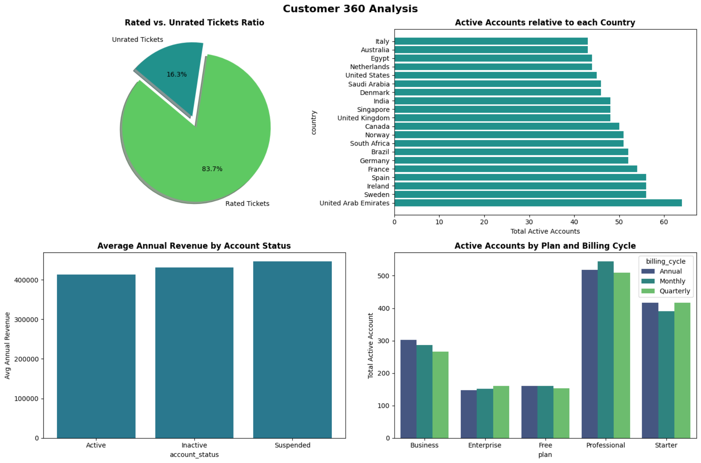
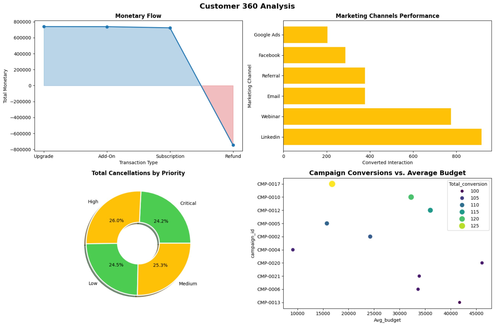

# Investigate Customer 360 Dataset

A comprehensive data analysis project built using **Python (Jupyter Notebook)** and core data science libraries (**Pandas**, **NumPy**, **Matplotlib**, and **Seaborn**) to perform a 360-degree investigation of customer behavior, support metrics, subscription dynamics, and marketing performance.

---

## Project Overview
* **Goal:** Uncover data-driven insights to boost customer retention, optimize revenue streams, and improve support services.
* **Key Focus Areas:** Evaluating subscription plan profitability, analyzing support ticket satisfaction and resolution metrics, and identifying high-converting marketing channels and campaigns.

---

## Workflow & Steps

### 1. Data Inspection
* Loaded and inspected multiple relational tables including `customers`, `campaign_interactions`, `marketing_campaigns`, `subscriptions`, `support_tickets`, and quarterly transaction files (`transactions_q1` to `transactions_q4`).
* Checked for missing values, duplicated entries, and data type inconsistencies across all datasets.
* Identified anomalies such as negative transaction amounts representing refunds and inconsistent string formatting in categorical columns.

### 2. Data Wrangling
* **Memory & Type Optimization:** Converted low-cardinality string columns (`account_status`, `plan`, `billing_cycle`, `channel`, `interaction_type`) to categorical data types.
* **Data Cleaning:** Cleaned currency fields by stripping symbols (`$`, `USD`, commas) and parsing them into floats, standardized date formats, and handled missing data points gracefully.
* **Data Integration:** Consolidated quarterly transaction sheets and mapped relational keys (`user_id`, `campaign_id`) to prepare for cross-table exploratory analysis.

### 3. Exploratory Data Analysis (EDA)
* Analyzed patterns across active, inactive, and suspended accounts, alongside annual revenue distributions.
* Investigated support ticket volumes, prioritizing categories to measure resolution hours and customer satisfaction scores.
* Evaluated subscription tiers (`Business`, `Enterprise`, `Free`, `Professional`, `Starter`) and billing cycles against cancellation rates and transactional volumes.

### 4. Data Visualizations & Insights
* Generated analytical plots to track conversion rates across marketing channels, average revenues per account status, and transaction trends over time.

---

### Part 1: Support Metrics, Geographic Distributions & Subscriptions
*Analysis of rated versus unrated support tickets, active account distributions across countries, average annual revenues by account status, and subscription tier breakdowns by billing cycles.*

---

### Part 2: Monetary Flow, Marketing Channels & Campaign Conversions
*Overview of transaction type monetary flows, marketing channel performance, cancellation rates grouped by priority, and campaign conversions measured against average budgets.*

